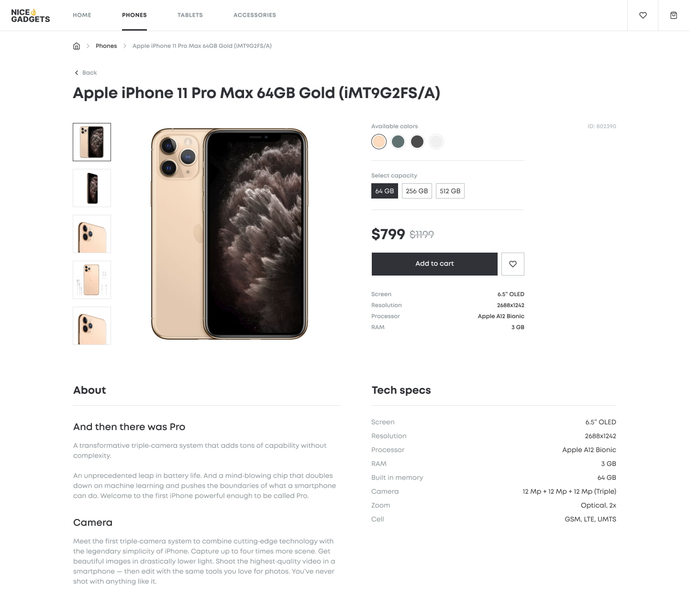
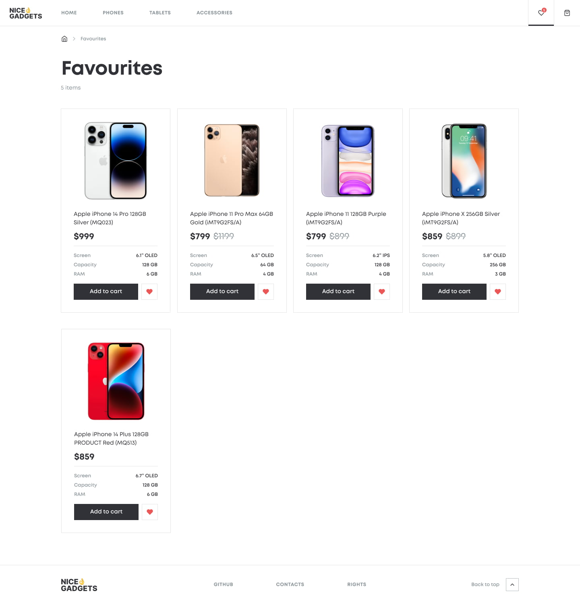

# Phone Catalog

Welcome to the Phone Catalog project!

This application is designed to provide a convenient shopping experience for tech enthusiasts looking for the latest gadgets. With a user-friendly interface, the app allows users to browse, explore, and manage their favorite **phones**, **tablets**, and **accessories** with ease.

The project has different pages that users can navigate through, each serving its own role:

1. **Home Page**: Designed to attract and engage the visitor's attention. It displays a **slider** with images of products available in the store. Additionally, it shows the available **product categories** and provides two separate **product sliders**: one for new products and one for products with the highest discounts, helping the user discover the latest arrivals and find the best deals.


2. **Products Pages**: 3 separate pages, each displaying a list of products by category: `phones`, `tablets`, and `accessories`. The user can sort the products by `newest`, `alphabetically`, or by `price`. Additionally, the user can choose the number of products displayed per page: `4`, `8`, `16`, or `All`. Pagination is also available to help navigate through multiple pages of products.


3. **Product Details Page**: Provides detailed information about an individual product, including **images**, **color options**, **available capacities**, **pricing**, **features**, and **description**. The user can select different product `images`, choose the `color`, and specify the `capacity`. At the bottom of the page, there is a **product slider** showcasing recommended products, which are chosen randomly.



4. **Favorites Page**: Shows a collection of products that the user has marked as **favorites**.



5. **Cart Page**: Displays the products that the user has added to their **shopping cart** for purchase. The user can adjust the quantity of each product in the cart and has the option to remove individual products or clear all products from the cart.


## Technologies Used

This project is built using a range of technologies to ensure a modern, flexible, and responsive application. Here is an overview of the used technologies and their specific roles in the project:

1. **React**: The library used for building the user interface. **React** is utilized for creating reusable UI components and managing the lifecycle of these components.

2. **Redux Toolkit**: Used for managing the application state. **Redux Toolkit** simplifies state management and makes it more predictable by offering tools for handling complex state logic and asynchronous actions.

3. **React Router DOM**: Integrated to manage routing within the application. **React Router DOM** facilitates navigation between different pages, ensuring a smooth and seamless user experience.

4. **TypeScript**: A programming language used to add static typing to JavaScript, enhancing code quality and reducing runtime errors.

5. **HTML**: The markup language used to structure the content on web pages.

6. **SCSS**: A CSS preprocessor that extends CSS with features like variables, nested rules, and mixins. SCSS is used to style the application's components.

Together, these technologies provide the application that adapts seamlessly to various screen sizes and devices. Whether viewed on a desktop, tablet, or smartphone, the layout and content adjust to provide an optimal user experience.

## Preview

For a live preview of the Phone Catalog, please visit the [DEMO LINK](https://yuriiyepikhov.github.io/Phone-Catalog/#/) here.

## Mockup

You can view the mockup design for the Phone Catalog [here](<https://www.figma.com/file/T5ttF21UnT6RRmCQQaZc6L/Phone-catalog-(V2)-Original>).

## Running the Project Locally

To run this project locally, follow these steps:

1. **Fork the Repository**: Click the **Fork** button in the top right corner of [this page](https://github.com/yuriiyepikhov/Phone-Catalog) to create your copy of the repository on GitHub.

2. **Clone the Repository**: Open your terminal, navigate to the directory where you want to store the project, and clone your copy of the repository into that directory:

```
mkdir Phone-Catalog
cd Phone-Catalog
git clone https://github.com/your-username/Phone-Catalog.git
```

3. **Open in Code Editor**: Open the project in your code editor (for example, Visual Studio Code):

```
code Phone-Catalog
```

4. **Install Dependencies**: Install the necessary dependencies using **npm**:

```
npm install
```

5. **Start the Project**: Start the project locally on your device:

```
npm start
```

6. **View in Browser**: Once the project has started, open your web browser and go to http://localhost:3000/ (or another port specified in the console output) to view the Phone Catalog.

These steps will allow you to run the project locally and make modifications as needed.
